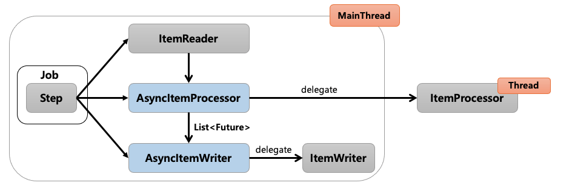
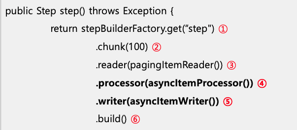
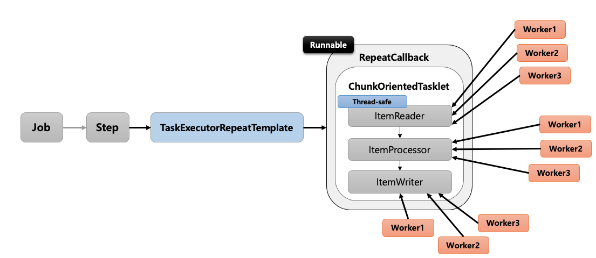
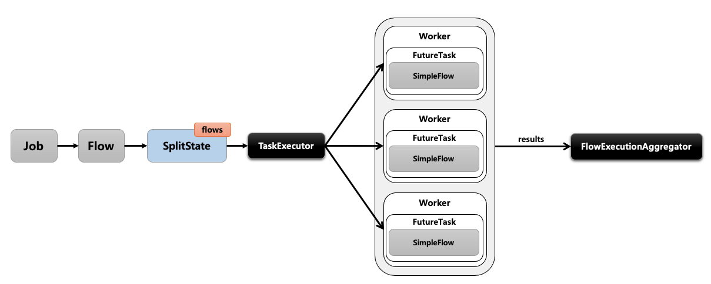
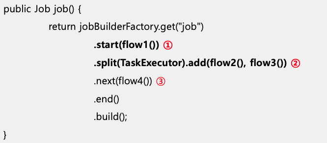
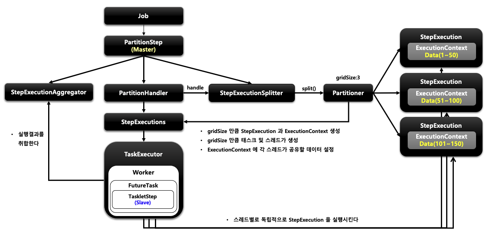
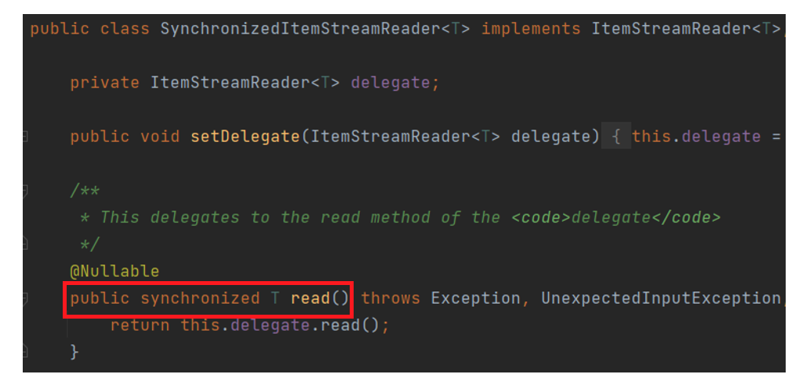

# < MultiThread >

## 2.10 MultiThread

### 2.10.1단일 스레드 vs 멀티 스레드

------


- 프로세스 내 특정 작업을 처리하는 스레드가 하나일 경우 단일 스레드, 여러 개일 경우 멀티 스레드라고 합니다.
- 작업 처리에 있어서 단일 스레드와 멀티 스레드의 선택 기준은 어떤 방식이 자원을 효율적으로 사용하고 성능 처리에 유리한가 하는 점입니다.
- 일반적으로 복잡한 처리나 대용량 데이터를 다루는 작업일 경우 전체 소요 시간 및 성능상의 이점을 가져오기 위해 멀티 스레드 방식을 사용합니다.
- 멀티 스레드 처리 방식은 데이터 동기화 이슈가 존재하기 때문에 주의해야 합니다.


### 2.10.2 스프링 배치 스레드 모델

------

- 스프링 배치는 기본적으로 단일 스레드 방식으로 작업을 처리합니다.
- 성능 향상과 대규모 데이터 처리 작업을 위한 비동기 처리 및 Scale out 기능을 제공합니다.
- Local과 Remote 처리를 지원합니다.
- AsyncItemProcessor / AsyncItemWriter
  - ItemProcessor에게 별도의 스레드가 할당되어 작업을 처리하는 방식
- Multi-threaded Step
  - Step 내 Chunk 구조인 ItemReader, ItemProcessor, ItemWriter 마다 여러 스레드가 할당되어 실행하는 방식
- Parallel Steps
  - Step마다 스레드가 할당되어 여러 개의 Step을 병렬로 실행하는 방법
- Partitioning
  - Master/Slave 방식으로 Master가 데이터를 파티셔닝 한 다음 각 파티션에게 스레드를 할당하여 Slave가 독립적으로 작동하는 방식


### 2.10.3 AsyncItemProcessor / AsyncItemWriter

------

#### 2.10.3.1 동작방식

- Step 안에서 ItemProcessor가 비동기적으로 동작하는 구조입니다.
- AsyncItemProcessor / AsyncItemWriter 둘이 함께 구성되어야 합니다.
- AsyncItemProcessor로부터 AsyncItemWriter가 받는 최종 결과값은 List<Future> 타입이며 비동기 실행이 완료될 때까지 대기합니다.
- 사용하려면 Spring-batch-integration 의존성이 필요합니다.
  - implementation ‘org.springframework.batch:spring-batch-integration’

 

- AsyncItemProcessor는 ItemProcessor에 실제 작업을 위임합니다.
- TaskExecutor로 비동기 실행을 하기 위한 스레드를 만들고 해당 스레드는 FutureTask를 실행합니다.
- FutureTask는 Callable 인터페이스를 실행하면서 그 안에서 ItemProcessor가 작업을 처리하게 됩니다.(Callable은 Runnable과 같이 스레드의 작업을 정의하는데 반환값이 있는 것) 이런 하나의 단위를 AsyncItemProcessor가 제공해서 처리를 위임하고 메인 스레드는 바로 다음 AsyncItemWriter로 넘어갑니다.
- AsyncItemWriter도 ItemWriter에게 작업을 위임합니다. ItemWriter는 Future 안에 있는 item들을 꺼내서 일괄처리하게 되는데 이때 Processor에서 작업 중인 비동기 실행의 결과값들을 모두 받아오기까지 대기합니다.




1. Step 기본 설정
2. 청크 개수 설정
3. ItemReader 설정(비동기 아님)
4. 비동기 실행을 위한 AsyncItemProcessor 설정
   - 스레드 풀 개수 만큼 스레드가 생성되어 비동기로 실행됩니다.
   - 내부적으로 실제 ItemProcessor에게 실행을 위임하고 결과를 Future에 저장합니다.
5. AsyncItemWriter 설정
   - 비동기 실행 결과 값들을 모두 받아오기 까지 대기합니다.
   - 내부적으로 실제 ItemWriter에게 최종 결과값을 넘겨주고 실행을 위임합니다.
6. TaskletStep 생성


#### 2.10.3.2 Example21 :AsyncItemProcessor + AsyncItemWriter

```xml
implementation 'org.springframework.batch:spring-batch-integration'
implementation 'org.springframework.boot:spring-boot-starter-data-jpa'
implementation 'com.h2database:h2'
```

의존성 추가가 필요합니다.

**Customer.java**

```java
import jakarta.persistence.Entity;
import jakarta.persistence.Id;
import lombok.AllArgsConstructor;
import lombok.Data;
import lombok.NoArgsConstructor;

@Data
@AllArgsConstructor
@NoArgsConstructor
@Entity
public class Customer {
    @Id
    private long id;
    private String name;
    private String age;
}
```

**Customer2.java**

```java
package com.example.batch_01.sample21;

import jakarta.persistence.Id;
import lombok.Builder;
import lombok.Data;

@Data
@Builder
public class Customer2 {
    @Id
    private long id;
    private String name;
    private String age;

}
```


**sample21JobConfiguration.java**

```java
import jakarta.persistence.EntityManagerFactory;
import lombok.RequiredArgsConstructor;
import org.springframework.batch.core.Job;
import org.springframework.batch.core.Step;
import org.springframework.batch.core.job.builder.JobBuilder;
import org.springframework.batch.core.launch.support.RunIdIncrementer;
import org.springframework.batch.core.repository.JobRepository;
import org.springframework.batch.core.step.builder.StepBuilder;
import org.springframework.batch.integration.async.AsyncItemProcessor;
import org.springframework.batch.integration.async.AsyncItemWriter;
import org.springframework.batch.item.ItemProcessor;
import org.springframework.batch.item.ItemReader;
import org.springframework.batch.item.ItemWriter;
import org.springframework.batch.item.database.builder.JdbcBatchItemWriterBuilder;
import org.springframework.batch.item.database.builder.JpaPagingItemReaderBuilder;
import org.springframework.context.annotation.Bean;
import org.springframework.context.annotation.Configuration;
import org.springframework.core.task.SimpleAsyncTaskExecutor;
import org.springframework.transaction.PlatformTransactionManager;

import javax.sql.DataSource;
import java.util.concurrent.Future;

@Configuration
@RequiredArgsConstructor
public class sample21JobConfiguration {
    private final PlatformTransactionManager transactionManager;
    private final JobRepository jobRepository;
    private final DataSource dataSource;
    private final EntityManagerFactory entityManagerFactory;
    private int chunkSize = 10;

    @Bean
    public Job sample21() {
        return new JobBuilder("sample21", jobRepository)
                .start(sample21_step01())
                .incrementer(new RunIdIncrementer())
                .build();
    }

    @Bean
    public Step sample21_step01() {
        return new StepBuilder("sample21_step01", jobRepository)
                .<Customer, Future<Customer2>>chunk(chunkSize,transactionManager) // Future 타입
                .reader(sample21_customItemReader())
                .processor(customAsyncItemProcessor())
                .writer(customAsyncItemWriter())
                .build();
    }

    @Bean
    public ItemReader<? extends Customer> sample21_customItemReader() {
        return new JpaPagingItemReaderBuilder<Customer>()
                .name("customItemReader")
                .pageSize(chunkSize)
                .entityManagerFactory(entityManagerFactory)
                .queryString("select c from Customer c order by c.id")
                .build();
    }

    @Bean
    public AsyncItemProcessor<Customer, Customer2> customAsyncItemProcessor() {
        AsyncItemProcessor<Customer, Customer2> asyncItemProcessor = new AsyncItemProcessor<>();
        asyncItemProcessor.setDelegate(customItemProcessor()); // customItemProcessor 로 작업 위임
        asyncItemProcessor.setTaskExecutor(new SimpleAsyncTaskExecutor()); // taskExecutor 세팅

        return asyncItemProcessor;
    }

    @Bean
    public ItemProcessor<Customer, Customer2> customItemProcessor() {
        return new ItemProcessor<Customer, Customer2>() {
            @Override
            public Customer2 process(Customer item) throws Exception {
                return Customer2.builder()
                        .id(item.getId())
                        .name(item.getName().toUpperCase())
                        .age(item.getAge())
                        .build();
            }
        };
    }

    @Bean
    public AsyncItemWriter<Customer2> customAsyncItemWriter() {
        AsyncItemWriter<Customer2> asyncItemWriter = new AsyncItemWriter<>();
        asyncItemWriter.setDelegate(customItemWriter()); // customItemWriter로 작업 위임
        return asyncItemWriter;
    }

    @Bean
    public ItemWriter<Customer2> customItemWriter() {
        return new JdbcBatchItemWriterBuilder<Customer2>()
                .dataSource(dataSource)
                .sql("insert into Customer2 values (:id, :age, :name)")
                .beanMapped()
                .build();
    }
}
```


Customer 데이터를 프로세서에서 Customer2객체로 전환하여 Writer로 전달하는 예시입니다. 사실상 코드는 동기 코드와 큰 차이 없이 위임하는 과정만 추가되었다고 봐도 무방합니다. 동기 Processor와 Writer을 만들고 비동기 Processor와 Writer를 만들어 그 안에서 위임하는 코드와 TaskExecutor 설정만 추가해주면 됩니다.

### 2.10.4 Multi-thread Step

------

#### 2.10.4.1 동작방식



- Step 내에서 멀티 스레드로 Chunk 기반 처리가 이뤄지는 구조 입니다.
- TaskExecutorRepeatTemplate이 반복자로 사용되며 설정한 개수(throttleLimit)만큼의 스레드를 생성하여 수행합니다.
- ItemReader는 반드시 Thread-safe인지 확인해야 합니다.
  - 데이터를 소스로 부터 읽어오는 역할이기 때문에 스레드마다 중복해서 데이터를 읽지 않도록 동기화가 보장되어야 합니다.
  - 스프링 배치에서 제공하는 **JdbcPagingItemReader, JpaPagingItemReader가 Thread-safe** 하게 동작합니다.
- 스레드끼리는 Chunk를 공유하지 않고 스레드마다 새로운 Chunk가 할당되어 데이터 동기화가 보장됩니다.


#### 2.10.4.2 Example 22 : Multi-Thread Step

**sample22JobConfiguration.java**

```java
import com.example.batch_01.sample21.Customer;
import com.example.batch_01.sample21.Customer2;
import jakarta.persistence.EntityManagerFactory;
import lombok.RequiredArgsConstructor;
import org.springframework.batch.core.Job;
import org.springframework.batch.core.Step;
import org.springframework.batch.core.job.builder.JobBuilder;
import org.springframework.batch.core.launch.support.RunIdIncrementer;
import org.springframework.batch.core.repository.JobRepository;
import org.springframework.batch.core.step.builder.StepBuilder;
import org.springframework.batch.item.ItemProcessor;
import org.springframework.batch.item.ItemReader;
import org.springframework.batch.item.ItemWriter;
import org.springframework.batch.item.database.builder.JdbcBatchItemWriterBuilder;
import org.springframework.batch.item.database.builder.JpaPagingItemReaderBuilder;
import org.springframework.context.annotation.Bean;
import org.springframework.context.annotation.Configuration;
import org.springframework.core.task.TaskExecutor;
import org.springframework.scheduling.concurrent.ThreadPoolTaskExecutor;
import org.springframework.transaction.PlatformTransactionManager;

import javax.sql.DataSource;

@Configuration
@RequiredArgsConstructor
public class sample22JobConfiguration {
    private final PlatformTransactionManager transactionManager;
    private final JobRepository jobRepository;
    private final DataSource dataSource;
    private final EntityManagerFactory entityManagerFactory;
    private int chunkSize = 10;

    @Bean
    public Job sample22() {
        return new JobBuilder("sample22", jobRepository)
                .start(sample22_step01())
                .incrementer(new RunIdIncrementer())
                .build();
    }

    @Bean
    public Step sample22_step01() {
        return new StepBuilder("sample22_step01", jobRepository)
                .<Customer, Customer2>chunk(chunkSize,transactionManager)
                .reader(sample22_customItemReader())
                .processor(sample22_customItemProcessor())
                .writer(sample22_customItemWriter())
                .taskExecutor(taskExecutor())
                .build();
    }

    @Bean
    public TaskExecutor taskExecutor() {
        ThreadPoolTaskExecutor taskExecutor = new ThreadPoolTaskExecutor();
        taskExecutor.setCorePoolSize(4); // 기본 스레드 풀 크기
        taskExecutor.setMaxPoolSize(8); // 4개의 스레드가 이미 처리중인데 작업이 더 있을 경우 몇개까지 스레드를 늘릴 것인지
        taskExecutor.setThreadNamePrefix("async-thread"); // 스레드 이름 prefix
        return taskExecutor;
    }

    @Bean
    public ItemReader<? extends Customer> sample22_customItemReader() {
        return new JpaPagingItemReaderBuilder<Customer>()
                .name("sample22_customItemReader")
                .pageSize(chunkSize)
                .entityManagerFactory(entityManagerFactory)
                .queryString("select c from Customer c order by c.id")
                .build();
    }


    @Bean
    public ItemProcessor<Customer, Customer2> sample22_customItemProcessor() {
        return new ItemProcessor<Customer, Customer2>() {
            @Override
            public Customer2 process(Customer item) throws Exception {
                return Customer2.builder()
                        .id(item.getId())
                        .name(item.getName().toUpperCase())
                        .age(item.getAge())
                        .build();
            }
        };
    }
  

    @Bean
    public ItemWriter<Customer2> sample22_customItemWriter() {
        return new JdbcBatchItemWriterBuilder<Customer2>()
                .dataSource(dataSource)
                .sql("insert into Customer2 values (:id, :age, :name)")
                .beanMapped()
                .build();

    }

}
```


코드는 동기 코드에서 taskExecutor세팅만 추가해주면 됩니다.

### 2.10.5 Parallel Steps

------

#### 2.10.5.1 동작방식



- SplitState를 사용해서 여러 개의 Flow들을 병렬적으로 실행하는 구조 입니다.
- 실행이 다 완료된 후 FlowExecutionStatus 결과들을 취합해서 다음 단계를 결정합니다.



1. flow 1 생성합니다.
2. flow2와 flow3를 생성하고 앞선 1까지 총 3개의 flow를 합치고 taskExecutor에서는 flow 개수만큼 스레드를 생성해서 각 flow를 실행시킵니다.
3. flow 4는 flow2와 flow3가 처리된 이후 실행됩니다.


#### 2.10.5.2 Example 23 : Parrel Steps

``` java
import lombok.RequiredArgsConstructor;
import org.springframework.batch.core.Job;
import org.springframework.batch.core.Step;
import org.springframework.batch.core.job.builder.FlowBuilder;
import org.springframework.batch.core.job.builder.JobBuilder;
import org.springframework.batch.core.job.flow.Flow;
import org.springframework.batch.core.job.flow.support.SimpleFlow;
import org.springframework.batch.core.repository.JobRepository;
import org.springframework.batch.core.step.builder.StepBuilder;
import org.springframework.batch.repeat.RepeatStatus;
import org.springframework.context.annotation.Bean;
import org.springframework.context.annotation.Configuration;
import org.springframework.core.task.SimpleAsyncTaskExecutor;
import org.springframework.core.task.TaskExecutor;
import org.springframework.transaction.PlatformTransactionManager;

@Configuration
@RequiredArgsConstructor
public class sample23JobConfiguration {
    private final PlatformTransactionManager transactionManager;
    private final JobRepository jobRepository;
    @Bean
    public Job job(JobRepository jobRepository) {
        return new JobBuilder("sample23", jobRepository)
                .start(splitFlow())
                .next(sample23_step4())
                .build()        //builds FlowJobBuilder instance
                .build();       //builds Job instance
    }
    @Bean
    public Flow splitFlow() {
        return new FlowBuilder<SimpleFlow>("splitFlow")
                .split(sample23_taskExecutor())
                .add(flow1(), flow2())
                .build();
    }
    @Bean
    public Flow flow1() {
        return new FlowBuilder<SimpleFlow>("flow1")
                .start(sample23_step1())
                .next(sample23_step2())
                .build();
    }
    @Bean
    public Flow flow2() {
        return new FlowBuilder<SimpleFlow>("flow2")
                .start(sample23_step3())
                .build();
    }
    @Bean
    public Step sample23_step1() {
        return new StepBuilder("sample23_step1",jobRepository)
                .tasklet((stepContribution, chunkContext) -> {
                    System.out.println("sample23_step1");
                    return RepeatStatus.FINISHED;
                },transactionManager)
                .build();
    }
    @Bean
    public Step sample23_step2() {
        return new StepBuilder("sample23_step2",jobRepository)
                .tasklet((stepContribution, chunkContext) -> {
                    System.out.println("sample23_step2");
                    return RepeatStatus.FINISHED;
                },transactionManager)
                .build();
    }
    @Bean
    public Step sample23_step3() {
        return new StepBuilder("sample23_step3",jobRepository)
                .tasklet((stepContribution, chunkContext) -> {
                    System.out.println("sample23_step3");
                    return RepeatStatus.FINISHED;
                },transactionManager)
                .build();
    }
    @Bean
    public Step sample23_step4() {
        return new StepBuilder("sample23_step4",jobRepository)
                .tasklet((stepContribution, chunkContext) -> {
                    System.out.println("sample23_step4");
                    return RepeatStatus.FINISHED;
                },transactionManager)
                .build();
    }
    @Bean
    public TaskExecutor sample23_taskExecutor() {
        return new SimpleAsyncTaskExecutor("spring_batch");
    }
}
```


### 2.10.6 Partitioning

#### 2.10.6.1 동작방식

- MasterStep이 SlaveStep을 실행시키는 구조입니다.
- SlaveStep은 각 스레드에 의해 독립적으로 실행됩니다.
- SlaveStep은 독립적인 StepExecution 파라미터 환경을 구성합니다.
- SlaveStep은 ItemReader / ItemProcessor / ItemWriter 등을 갖고 동작하며 작업을 독립적으로 병렬 처리합니다.
- MasterStep은 PartitionStep이며 SlaveStep은 TaskletStep, FlowStep 등이 올 수 있습니다.

 MasterStep과 SlaveStep 둘다 Step인데 MasterStep에서 Partitioner가 grid Size만큼 StepExecution을 만들고 partitioner의 방식에 따라 StepExecution의 ExecutionContext 안에 **데이터 자체가 아닌 데이터 정보** 를 넣어둡니다.(예시를 보면 이해가 쉽습니다.) 그리고 gridSize만큼 스레드를 생성하여 SlaveStep을 각 스레드별로 실행합니다.


그림을 보면 알 수 있듯이, 각 스레드는 같은 SlaveStep을 실행하지만, 서로 다른 StepExecution 정보를 가지고 수행됩니다. Partitioning은 Scope를 지정하게 되는데 이에 따라 서로 같은 SlaveStep을 수행하게 되어 같은 프록시를 바라보지만 실제 실행할 때는 결과적으로 각 스레드마다 타겟 빈을 새로 만들기 때문에 서로 다른 타겟 빈을 바라보게 되어 동시성 이슈가 없습니다.


1. step 기본 설정
2. slaveStep에 적용할 Partitioner 설정
3. Slave역할을 하는 Step 설정
4. 몇 개의 파티션으로 나눌 것인지 값 설정
5. 스레드 풀 실행자 설정

#### 2.10.6.2 Example 24 : partitioning

```java
import com.example.batch_01.sample21.Customer;
import com.example.batch_01.sample21.Customer2;
import jakarta.persistence.EntityManagerFactory;
import lombok.RequiredArgsConstructor;
import org.springframework.batch.core.Job;
import org.springframework.batch.core.Step;
import org.springframework.batch.core.configuration.annotation.StepScope;
import org.springframework.batch.core.job.builder.JobBuilder;
import org.springframework.batch.core.launch.support.RunIdIncrementer;
import org.springframework.batch.core.partition.support.Partitioner;
import org.springframework.batch.core.repository.JobRepository;
import org.springframework.batch.core.step.builder.StepBuilder;
import org.springframework.batch.item.database.JdbcBatchItemWriter;
import org.springframework.batch.item.database.JpaPagingItemReader;
import org.springframework.batch.item.database.builder.JdbcBatchItemWriterBuilder;
import org.springframework.batch.item.database.builder.JpaPagingItemReaderBuilder;
import org.springframework.beans.factory.annotation.Value;
import org.springframework.context.annotation.Bean;
import org.springframework.context.annotation.Configuration;
import org.springframework.core.task.TaskExecutor;
import org.springframework.scheduling.concurrent.ThreadPoolTaskExecutor;
import org.springframework.transaction.PlatformTransactionManager;

import javax.sql.DataSource;
import java.util.HashMap;
import java.util.Map;

@Configuration
@RequiredArgsConstructor
public class sample24JobConfiguration {
    private final PlatformTransactionManager transactionManager;
    private final JobRepository jobRepository;
    private final DataSource dataSource;
    private final EntityManagerFactory entityManagerFactory;
    private int chunkSize = 10;
    private int poolSize = 4 ;

    @Bean
    public Job sample24() {
        return new JobBuilder("sample24",jobRepository)
                .start(masterStep())
                .incrementer(new RunIdIncrementer())
                .build();
    }

    @Bean
    public Step masterStep() {
        return new StepBuilder("sample24_master",jobRepository)
                .partitioner(slaveStep().getName(),partitioner()) // slaveStep에서 사용될 partitioner 구현체 등록
                .step(slaveStep()) // 파티셔닝 될 Step 등록(SlaveStep)
                .gridSize(poolSize) // StepExecution이 형성될 개수 = 파티션 되는 데이터 뭉텅이 수 = 스레드 풀 사이즈과 일치시키는게 좋음
                .taskExecutor(sample24_taskExecutor()) // MasterStep이 SlaveStep을 다루는 스레드 형성 방식
                .build();
    }

    
    @Bean
    // 데이터 파티셔닝 방식
    public Partitioner partitioner() {
        ColumnRangePartitioner partitioner = new ColumnRangePartitioner(); // 아래 코드쪽 클래스 코드 참고
        partitioner.setDataSource(dataSource);
        partitioner.setTable("Customer"); // 파티셔닝 할 테이블
        partitioner.setColumn("id"); // 파티셔닝 기준 컬럼
        return partitioner;
    }

    @Bean
    public Step slaveStep() {
        return new StepBuilder("sample24_slaveStep",jobRepository)
                .<Customer,Customer2>chunk(chunkSize,transactionManager)
                .reader(sample24_customItemReader(null,null))
                .writer(sample24_customItemWriter())
                .build();
    }

    @Bean
    public TaskExecutor sample24_taskExecutor() {
        ThreadPoolTaskExecutor taskExecutor = new ThreadPoolTaskExecutor();
        taskExecutor.setCorePoolSize(poolSize); // 기본 스레드 풀 크기
        taskExecutor.setMaxPoolSize(8); // 4개의 스레드가 이미 처리중인데 작업이 더 있을 경우 몇개까지 스레드를 늘릴 것인지
        taskExecutor.setThreadNamePrefix("async-thread"); // 스레드 이름 prefix
        return taskExecutor;
    }

    @Bean
    @StepScope
    // partitioner에서 stepExecutionContext에 데이터 정보를 넣어두기 때문에 런타임에 해당 과정이 발생
    // 따라서 해당 값을 사용하기 위해서는 Scope를 사용해서 프록시를 통한 지연 로딩을 사용해야 함.
    // 반환값은 ItemReader이 아닌 구현체를 사용해야 하는데 이는 아래서 설명
    public JpaPagingItemReader<? extends Customer> sample24_customItemReader(
            @Value("#{stepExecutionContext['minValue']}") Long minValue,
           @Value("#{stepExecutionContext['maxValue']}") Long maxValue
    ) {
        Map<String,Object> parameters = new HashMap<>();
        parameters.put("minValue",minValue);
        parameters.put("maxValue",maxValue);

        return new JpaPagingItemReaderBuilder<Customer>()
                .name("customItemReader")
                .entityManagerFactory(entityManagerFactory)
                .pageSize(chunkSize)
                .queryString("SELECT c FROM Customer c WHERE :minValue <= c.id and c.id <= :maxValue order by c.id")
                .parameterValues(parameters)
                .build();
    }

    @Bean
    @StepScope
    public JdbcBatchItemWriter<Customer2> sample24_customItemWriter() {
        return new JdbcBatchItemWriterBuilder<Customer2>()
                .dataSource(dataSource)
                .sql("insert into Customer2 values (:id, :age, :name)")
                .beanMapped()
                .build();
    }
}
```

**ColumnRangePartitioner.java**

```java
// Spring Batch 공식 샘플 코드
// https://github.com/spring-projects/spring-batch/blob/main/spring-batch-samples/src/main/java/org/springframework/batch/sample/common/ColumnRangePartitioner.java
public class ColumnRangePartitioner implements Partitioner {

    private JdbcOperations jdbcTemplate;

    private String table;

    private String column;

    public void setTable(String table) {
        this.table = table;
    }

    public void setColumn(String column) {
        this.column = column;
    }

    public void setDataSource(DataSource dataSource) {
        jdbcTemplate = new JdbcTemplate(dataSource);
    }


    @Override
    public Map<String, ExecutionContext> partition(int gridSize) {
        int min = jdbcTemplate.queryForObject("SELECT MIN(" + column + ") from " + table, Integer.class);
        int max = jdbcTemplate.queryForObject("SELECT MAX(" + column + ") from " + table, Integer.class);
        int targetSize = (max - min) / gridSize + 1;

        Map<String, ExecutionContext> result = new HashMap<>();
        int number = 0;
        int start = min;
        int end = start + targetSize - 1;

        while (start <= max) {
            ExecutionContext value = new ExecutionContext();
            result.put("partition" + number, value);

            if (end >= max) {
                end = max;
            }
            value.putInt("minValue", start);
            value.putInt("maxValue", end);
            start += targetSize;
            end += targetSize;
            number++;
        }

        return result;
    }
}
```


StepExecutionContext에 데이터 자체를 저장하는게 아니라 데이터 정보를 저장한다고 했을 때 이해가 어려웠을 것입니다. 바로 위 코드의 ColumnRangePartitioner 클래스를 보면 테이블과 컬럼명을 받아서 gridSize로 쪼갠 뒤 쪼갠 값의 첫, 마지막 인덱스를 ExecutionContext에 저장하고 있습니다. 위 코드를 기준으로 보자면, itemReader가 읽어야 하는 데이터가 100개가 있고 gridSize는 4입니다. partitioner에서는 Customer 테이블과 id컬럼을 받아서 itemReader가 읽어야할 데이터가 100개인 것을 확인하고 100을 4로 나눕니다. 그럼 각 StepExecution은 25개씩 데이터를 처리해야 된다는 계산이 나오게 되어 각 ExecutionContext에 minValue와 MaxValue를 담습니다.(1,25), (26,50), (51,75) (76,100) 그럼 itemReader에서는 각 StepExecution마다 해당 정보가 들어가 있으니 Scope를 사용한 지연로딩을 통해 값을 파라미터로 꺼내서 itemReader의 쿼리에 사용하는 방식입니다. 뭔가 복잡해 보이지만 사실상 데이터베이스 파티셔닝과 거의 유사합니다.


# < 주의사항 > 

#### Scope Proxy

```java
@Bean
@StepScope
public ItemReader<? extends Customer> customItemReader(
        @Value("#{stepExecutionContext['minValue']}") Long minValue,
        @Value("#{stepExecutionContext['maxValue']}") Long maxValue) {
        ....

        return new JpaPagingItemReaderBuilder<Customer>()
                ....
                .build();
}
```


처음에 위와 같이 사용했다가 null 포인트 예외가 터져서 한참 찾았습니다. Scope가 아닐 경우에는 Jpa 구현체가 빈으로 등록되기 때문에 전혀 문제가 되지 않습니다. 하지만 위 코드와 같이 Scope를 사용하면 구현체가 아니라 ItemReader 인터페이스의 프록시 객체가 빈을 등록되서 문제가 발생합니다. 구현체의 경우 ItemReader와 ItemStream을 모두 구현하고 있기 때문에 문제가 없지만 ItemReader는 read 메서드만 있습니다. 실제로 stream을 open/close하는 메서드는 ItemStream에 있습니다. 즉, 위와 같이 사용하면 EntityManagerFactory에서 entityManager을 생성하는게 원래 Stream에서 진행되는 거라 itemReader인 프록시는 그런게 없기 때문에 null 포인트 예외가 발생하게 됩니다. 이에 대한 해결책은 그냥 구현체를 반환하면 됩니다.

```java
@Bean
@StepScope
public JpaPagingItemReader<? extends Customer> customItemReader(
        @Value("#{stepExecutionContext['minValue']}") Long minValue,
        @Value("#{stepExecutionContext['maxValue']}") Long maxValue) {
        ....

        return new JpaPagingItemReaderBuilder<Customer>()
                ....
                .build();
}
```


더욱 자세한 내용은 [여기](https://jojoldu.tistory.com/132)를 참고하시면 좋을 것 같습니다.

#### SynchronizedItemStreamReader

------




 Thread-safe 하지 않은 ItemReader를 Thread-safe하게 처리하도록 하는 기능을 제공합니다. 단순히 Thread-safe하지 않은 ItemReader를 SynchronizedItemStreamReader로 한번 감싸주면 되기 때문에 적용 방식은 매우 간단합니다.

#### 예시

```java
@Configuration
@RequiredArgsConstructor
public class HelloJobConfiguration {
    private final JobBuilderFactory jobBuilderFactory;
    private final StepBuilderFactory stepBuilderFactory;
    private final DataSource dataSource;
    private int chunkSize = 10;

    @Bean
    public Job helloJob() {
        return jobBuilderFactory.get("job")
                .start(step())
                .incrementer(new RunIdIncrementer())
                .build();
    }


    @Bean
    public Step step() {
        return stepBuilderFactory.get("step")
                .<Customer,Customer2>chunk(chunkSize)
                .reader(customItemReader())
                .writer(customItemWriter())
                .taskExecutor(taskExecutor())
                .build();
    }
    @Bean
    public TaskExecutor taskExecutor() {
        ThreadPoolTaskExecutor taskExecutor = new ThreadPoolTaskExecutor();
        taskExecutor.setCorePoolSize(4); // 기본 스레드 풀 크기
        taskExecutor.setMaxPoolSize(8); // 4개의 스레드가 이미 처리중인데 작업이 더 있을 경우 몇개까지 스레드를 늘릴 것인지
        taskExecutor.setThreadNamePrefix("async-thread"); // 스레드 이름 prefix
        return taskExecutor;
    }

    @Bean
    public SynchronizedItemStreamReader<Customer> customItemReader() {
        // thread-safe 하지 않은 Reader
        JdbcCursorItemReader<Customer> notSafetyReader = new JdbcCursorItemReaderBuilder<Customer>()
                .name("customItemReader")
                .dataSource(dataSource)
                .fetchSize(chunkSize)
                .rowMapper(new BeanPropertyRowMapper<>(Customer.class))
                .sql("select id, name, age from customer order by id")
                .build();

        // SyncStreamReader 만들고 인자로 thread-safe하지 않은 Reader를 넘기면 
        // Read하는 작업이 동기화 되서 진행된다.
        return new SynchronizedItemStreamReaderBuilder<Customer>()
                .delegate(notSafetyReader)
                .build();
    }

    @Bean
    public JdbcBatchItemWriter<Customer2> customItemWriter() {
        return new JdbcBatchItemWriterBuilder<Customer2>()
                .dataSource(dataSource)
                .sql("insert into customer2 values (:id, :age, :name)")
                .beanMapped()
                .build();
    }

}
```

