# Spring Batch 별첨

## *Chunk 상세

Spring Batch에서의 Chunk란 데이터 덩어리로 작업 할 때 **각 커밋 사이에 처리되는 row 수**를 얘기합니다.
즉, Chunk 지향 처리란 **한 번에 하나씩 데이터를 읽어 Chunk라는 덩어리를 만든 뒤, Chunk 단위로 트랜잭션**을 다루는 것을 의미합니다.

여기서 트랜잭션이라는게 중요한데요.
Chunk 단위로 트랜잭션을 수행하기 때문에 **실패할 경우엔 해당 Chunk 만큼만 롤백**이 되고, 이전에 커밋된 트랜잭션 범위까지는 반영이 된다는 것입니다.

Chunk 지향 처리가 결국 Chunk 단위로 데이터를 처리한다는 의미이기 때문에 그림으로 표현하면 아래와 같습니다.

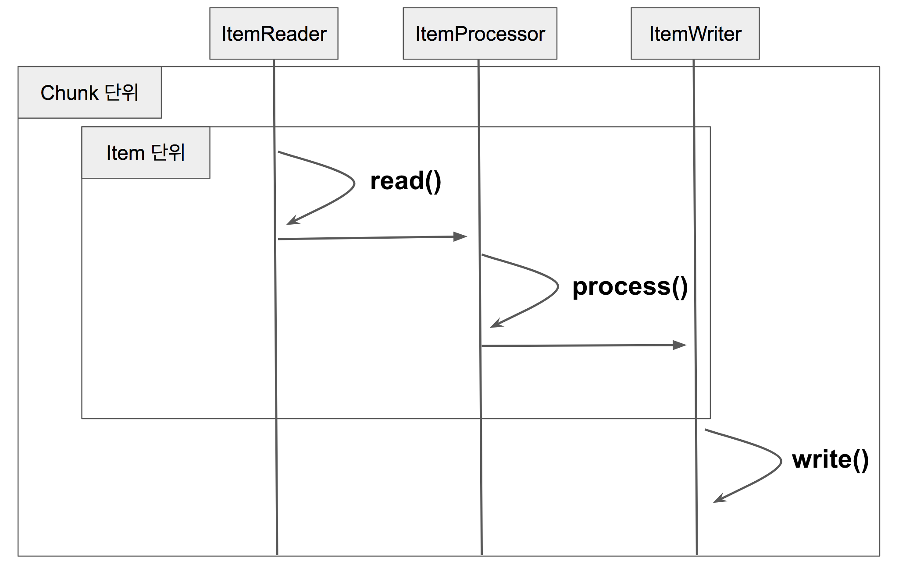

- Reader에서 데이터를 하나 읽어옵니다
- 읽어온 데이터를 Processor에서 가공합니다
- 가공된 데이터들을 별도의 공간에 모은 뒤, Chunk 단위만큼 쌓이게 되면 Writer에 전달하고 Writer는 일괄 저장합니다.

**Reader와 Processor에서는 1건씩 다뤄지고, Writer에선 Chunk 단위로 처리**된다는 것만 기억하시면 됩니다.

Chunk 지향 처리를 Java 코드로 표현하면 아래처럼 될 것 같습니다.

```java
for(int i=0; i<totalSize; i+=chunkSize){ // chunkSize 단위로 묶어서 처리
    List items = new Arraylist();
    for(int j = 0; j < chunkSize; j++){
        Object item = itemReader.read()
        Object processedItem = itemProcessor.process(item);
        items.add(processedItem);
    }
    itemWriter.write(items);
}
```

**chunkSize별로 묶어서 처리**된다는 의미가 이해가 되셨나요?
자 그럼 이제 Chunk 지향 처리가 어떻게 되고 있는지 실제 Spring Batch 내부 코드를 보면서 알아보겠습니다.

### ChunkOrientedTasklet 엿보기

Chunk 지향 처리의 전체 로직을 다루는 것은 `ChunkOrientedTasklet` 클래스입니다.
클래스 이름만 봐도 어떤 일을 하는지 단번에 알 수 있을것 같습니다.

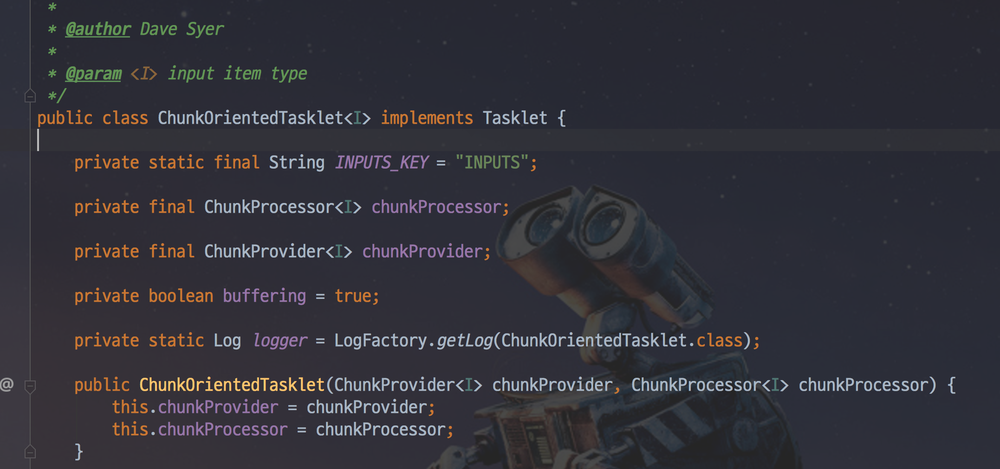

여기서 자세히 보셔야할 코드는 `execute()` 입니다.
Chunk 단위로 작업하기 위한 전체 코드가 이곳에 있다고 보시면 되는데요.
내부 코드는 아래와 같습니다.

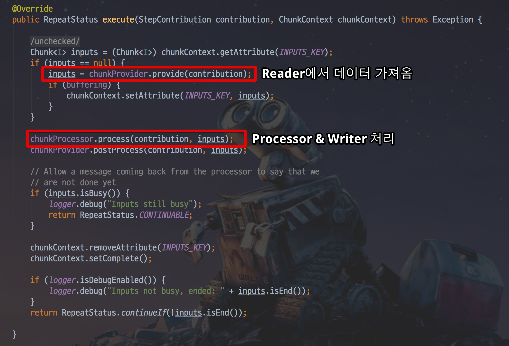

- `chunkProvider.provide()`로 Reader에서 Chunk size만큼 데이터를 가져옵니다.
- `chunkProcessor.process()` 에서 Reader로 받은 데이터를 가공(Processor)하고 저장(Writer)합니다.

데이터를 가져오는 `chunkProvider.provide()`를 가보시면 어떻게 데이터를 가져오는지 알 수 있습니다.

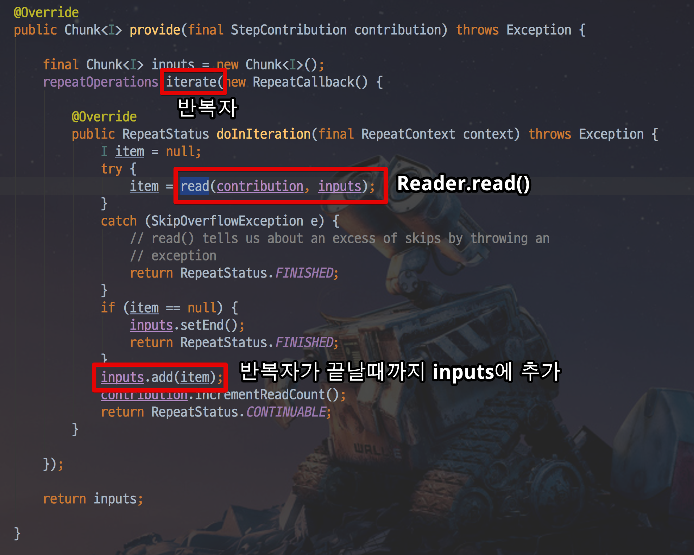

`inputs`이 ChunkSize만큼 쌓일때까지 `read()`를 호출합니다.
이 `read()` 는 내부를 보시면 실제로는 `ItemReader.read`를 호출합니다.

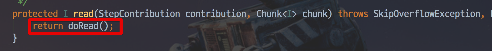

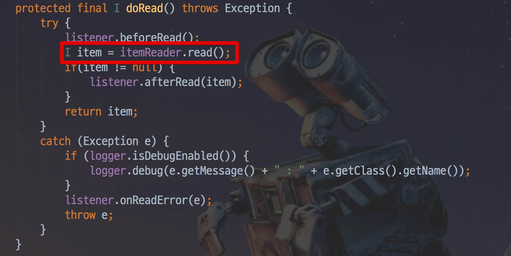

즉, `ItemReader.read`에서 1건씩 데이터를 조회해 Chunk size만큼 데이터를 쌓는 것이 `provide()`가 하는 일입니다.

자 그럼 이렇게 쌓아준 데이터를 어떻게 가공하고 저장하는지 한번 확인해보겠습니다.

### SimpleChunkProcessor 엿보기

Processor와 Writer 로직을 담고 있는 것은 `ChunkProcessor` 가 담당하고 있습니다.

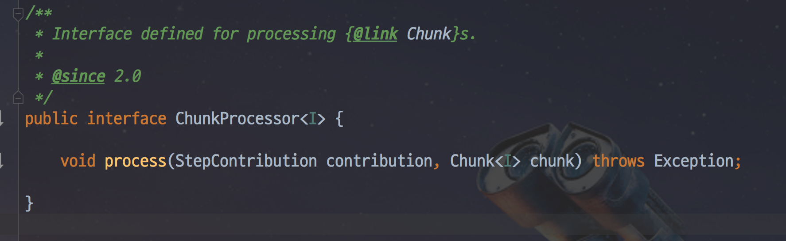

인터페이스이기 때문에 실제 구현체가 있어야 하는데요.
기본적으로 사용되는 것이 `SimpleChunkProcessor` 입니다.

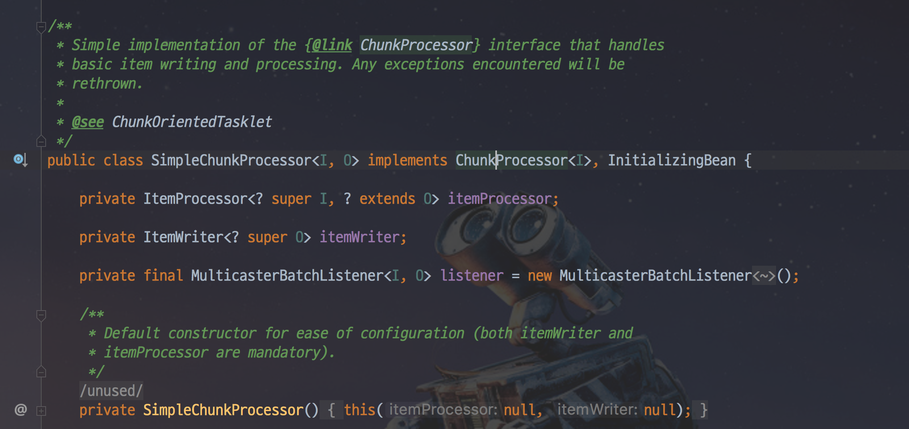

위 클래스를 보시면 Spring Batch에서 Chunk 단위 처리를 어떻게 하는지 아주 상세하게 확인할 수 있습니다.
처리를 담당하는 핵심 로직은 `process()` 입니다.
이 `process()`의 코드는 아래와 같습니다.

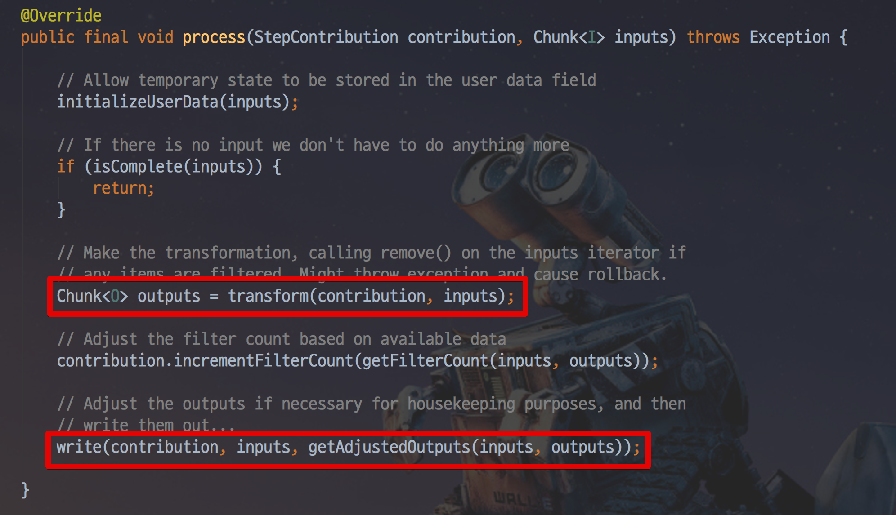

- ```
  Chunk<I> inputs
  ```

  를 파라미터로 받습니다.

  - 이 데이터는 앞서 `chunkProvider.provide()` 에서 받은 ChunkSize만큼 쌓인 item입니다.

- `transform()` 에서는 전달 받은 `inputs`을 `doProcess()`로 전달하고 변환값을 받습니다.

- ```
  transform()
  ```

  을 통해 가공된 대량의 데이터는

   

  ```
  write()
  ```

  를 통해 일괄 저장됩니다.

  - `write()`는 저장이 될수도 있고, 외부 API로 전송할 수 도 있습니다.
  - 이는 개발자가 ItemWriter를 어떻게 구현했는지에 따라 달라집니다.

여기서 `transform()`은 반복문을 통해 `doProcess()`를 호출하는데요.
해당 메소드는 ItemProcessor의 `process()`를 사용합니다.

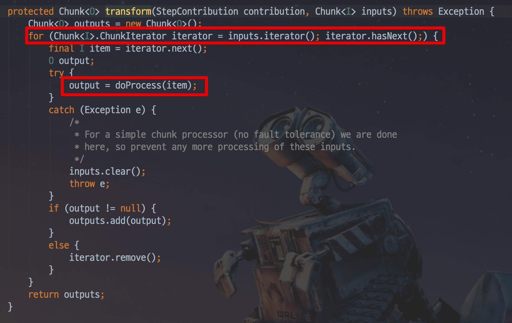

`doProcess()` 를 처리하는데 만약 ItemProcessor가 없다면 item을 그대로 반환하고 있다면 ItemProcessor의 `process()`로 가공하여 반환합니다.

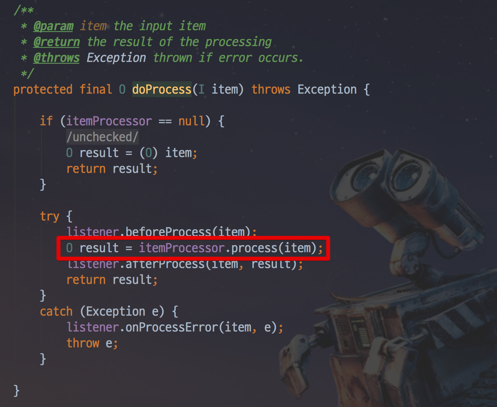

그리고 이렇게 가공된 데이터들은 위에서도 나와있듯이 SimpleChunkProcessor의 `doWrite()` 를 호출하여 일괄 처리 합니다.

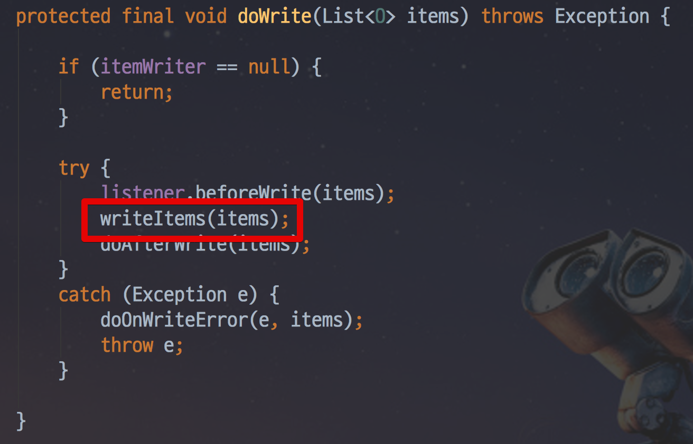


## *Batch vs Quartz?

간혹 Spring Batch와 Spring Quartz를 비교하는 글을 보게 되는데요.
둘은 역할이 완전히 다릅니다.
**Quartz는 스케줄러의 역할**이지, Batch 와 같이 **대용량 데이터 배치 처리에 대한 기능을 지원하지 않습니다**.
반대로 Batch 역시 Quartz의 다양한 스케줄 기능을 지원하지 않아서 보통은 Quartz + Batch 또는 Batch Application 에 다양한 Scheduler를 조합해서 사용합니다.
정해진 스케줄마다 Quartz가 Spring Batch를 실행하는 구조라고 보시면 됩니다.


## *ExitCodeGenerator

애플리케이션이 정상적으로 종료되는 것은 꽤 중요하다. 애플리케이션의 갑작스런 죽음과는 달리 특정 상황이 발생했고 그 상황에 맞춰 종료코드를 반환하고 죽는다면 그에 대한 대응하기가 수월해진다. 스프링 부트에서 장애대응을 수월하게 할 수 있도록 특정상황에 따른 종료코드(Exit Code)를 반환하며 애플리케이션을 정상종료 시키는 기능을 제공한다.

스프링 부트 참고문서에 나온 예제는 다음과 같다.

```
@SpringBootApplication
public class ExitCodeApplication {
	@Bean
	public ExitCodeGenerator exitCodeGenerator() {
		return () -> 42;
	}
	public static void main(String[] args) {
		System.exit(SpringApplication
				.exit(SpringApplication.run(ExitCodeApplication.class, args)));
	}
}
```

이와 관련된 것은 아래 두 가지다.

- `ExitCodeGenerator`
- `SpringApplication.exit(ApplicationContext context, ExitCodeGenerator… exitCodeGenerators)`

위 코드는 대략 다음과 같다.

```
ExitCodeGenerator
@FunctionalInterface
public interface ExitCodeGenerator {
    /**
     * Returns the exit code that should be returned from the application.
     * @return the exit code.
     */
    int getExitCode();
}
```

`SpringApplication.exit()` 메서드

```
public static int exit(ApplicationContext context,
        ExitCodeGenerator... exitCodeGenerators) {
    Assert.notNull(context, "Context must not be null");
    int exitCode = 0;
    try {
        try {
            ExitCodeGenerators generators = new ExitCodeGenerators();
            Collection<ExitCodeGenerator> beans = context
                    .getBeansOfType(ExitCodeGenerator.class).values();
            generators.addAll(exitCodeGenerators);
            generators.addAll(beans);
            exitCode = generators.getExitCode();
            if (exitCode != 0) {  // (1)
                context.publishEvent(new ExitCodeEvent(context, exitCode));
            }
        }
        finally {
            close(context);
        }
    }
    catch (Exception ex) {
        ex.printStackTrace();
        exitCode = (exitCode == 0 ? 1 : exitCode);
    }
    return exitCode;
}
```

`exitCode != 0` 조건이 만족하면 `ExitCodeEvent` 이벤트가 발생한다.

`ExitCodeGenerator` 인터페이스를 `SpringApplication.exit()` 전달하면 `SpringApplication.exit()`는 `getExitCode()` 메서드를 호출하여 종료코드를 받는다. 이 때 이 종료코드가 0인 경우에는 일반적인 애플리케이션 종료를 진행한다.

**`0`이 아닌 경우에는 종료코드 발송 이벤트(`ExitCodeEvent`)가 발생한 후 애플리케이션이 종료된다.**


애플리케이션에서 특정 예외발생 시 다음과 같은 형식으로 종료코드 반환 이벤트를 발생시키며 종료시킬 수 있겠다.

```
@Autowired
ExitCodeGenerator exitCodeGenerator;

try {
	// 예외가 발생할 수 있는 상황
} catch (WannabeException e) {
    // 특정조건의 예외가 발생하면 애플리케이션을 안전하게 종료시킬 수도 있겠다.
    //
    SpringApplication.exit(applicationContext, exitCodeGenerator);
}
```

`WannabeException`에 대한 예외처리를 할 수 있는 `@ControllerAdvice` 클래스를 정의해서 `WannabeException`가 발생하면 특정코드를 발생하며 종료되도록 하는 것도 가능하겠다.

```
@ControllerAdvice
class GlobalControllerExceptionHandler {
    @ExceptionHandler(WannabeException.class)
    public void handleConflict(WannabeException we) {
        // todo we
        SpringApplication.exit(applicationContext, () -> 810301);
    }
}
```

참고 URL : https://docs.spring.io/spring-boot/docs/current/reference/htmlsingle/#features.spring-application.application-exit


## * JobParameter와 Scope

Spring Batch의 경우 외부 혹은 내부에서 파라미터를 받아 여러 Batch 컴포넌트에서 사용할 수 있게 지원하고 있습니다.
이 파라미터를 **Job Parameter**라고 합니다.
Job Parameter를 사용하기 위해선 항상 Spring Batch 전용 Scope를 선언해야만 하는데요.
크게 `@StepScope`와 `@JobScope` 2가지가 있습니다.
사용법은 간단한데, 아래와 같이 SpEL로 선언해서 사용하시면 됩니다.

```java
@Value("#{jobParameters[파라미터명]}")
```

> `jobParameters` 외에도 `jobExecutionContext`, `stepExecutionContext` 등도 SpEL로 사용할 수 있습니다.
> @JobScope에선 `stepExecutionContext`는 사용할 수 없고, `jobParameters`와 `jobExecutionContext`만 사용할 수 있습니다.

각각의 Scope에서 사용하는 샘플 코드는 아래와 같습니다.

**JobScope**

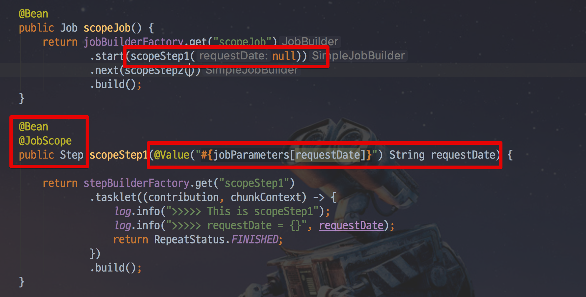

**StepScope**

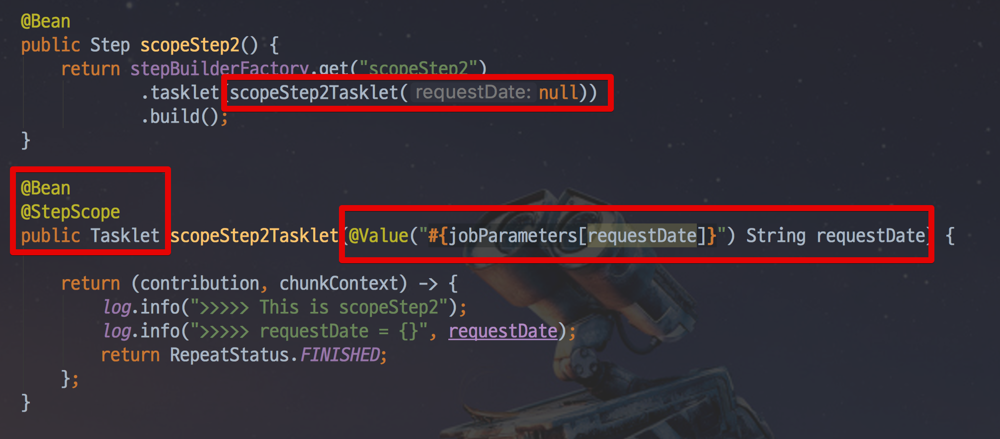

**@JobScope는 Step 선언문에서** 사용 가능하고, **@StepScope는 Tasklet이나 ItemReader, ItemWriter, ItemProcessor**에서 사용할 수 있습니다.

spring batch 5.0 이전에 Job Parameter의 타입으로 사용할 수 있는 것은 `Double`, `Long`, `Date`, `String` 이 있습니다.
아쉽지만 `LocalDate`와 `LocalDateTime`이 없어 `String` 으로 받아 타입변환을 해서 사용해야했었지만

V5.0 이후에는 더 많은 타입이 추가되었습니다.

예제 코드를 보시면 호출하는 쪽에서 `null` 를 할당하고 있는데요.
이는 **Job Parameter의 할당이 어플리케이션 실행시에 하지 않기 때문에** 가능합니다.


## * JobScope & StepScope

Spring Batch는 `@StepScope`와 `@JobScope` 라는 아주 특별한 Bean Scope를 지원합니다.
아시다시피, **Spring Bean의 기본 Scope는 singleton**인데요.
그러나 아래처럼 Spring Batch 컴포넌트 (Tasklet, ItemReader, ItemWriter, ItemProcessor 등)에 `@StepScope`를 사용하게 되면

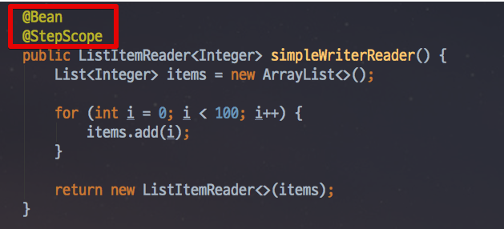

Spring Batch가 Spring 컨테이너를 통해 지정된 **Step의 실행시점에 해당 컴포넌트를 Spring Bean으로 생성**합니다.
마찬가지로 `@JobScope`는 **Job 실행시점**에 Bean이 생성 됩니다.
즉, **Bean의 생성 시점을 지정된 Scope가 실행되는 시점으로 지연**시킵니다.
일종의 @Lazy Annotation 과 유사한 역할을 한다고 볼 수 있습니다.

> 어떻게 보면 MVC의 request scope와 비슷할 수 있겠습니다.
> request scope가 request가 왔을때 생성되고, response를 반환하면 삭제되는것처럼, JobScope, StepScope 역시 Job이 실행되고 끝날때, Step이 실행되고 끝날때 생성/삭제가 이루어진다고 보시면 됩니다.

이렇게 Bean의 생성시점을 어플리케이션 실행 시점이 아닌, Step 혹은 Job의 실행시점으로 지연시키면서 얻는 장점은 크게 2가지가 있습니다.

첫째로, **JobParameter의 Late Binding**이 가능합니다.
Job Parameter가 StepContext 또는 JobExecutionContext 레벨에서 할당시킬 수 있습니다.
꼭 Application이 실행되는 시점이 아니더라도 Controller나 Service와 같은 **비지니스 로직 처리 단계에서 Job Parameter를 할당**시킬 수 있습니다.
이 부분은 아래에서 좀 더 자세하게 예제와 함께 설명드리겠습니다.

두번째로, **동일한 컴포넌트를 병렬 혹은 동시에 사용할때 유용**합니다.
Step 안에 Tasklet이 있고, 이 Tasklet은 멤버 변수와 이 멤버 변수를 변경하는 로직이 있다고 가정해봅시다.
이 경우 `@StepScope` 없이 Step을 병렬로 실행시키게 되면 **서로 다른 Step에서 하나의 Tasklet을 두고 마구잡이로 상태를 변경**하려고 할것입니다.
하지만 `@StepScope`가 있다면 **각각의 Step에서 별도의 Tasklet을 생성하고 관리하기 때문에 서로의 상태를 침범할 일이 없습니다**.


Job Parameters는 `@Value`를 통해서 가능합니다.
그러다보니 여러가지 오해가 있을 수 있는데요.
Job Parameters는 Step이나, Tasklet, Reader 등 Batch 컴포넌트 Bean의 생성 시점에 호출할 수 있습니다만, 정확히는 **Scope Bean을 생성할때만 가능**합니다.
즉, **`@StepScope`, `@JobScope` Bean을 생성할때만 Job Parameters가 생성**되기 때문에 사용할 수 있습니다.

예를 들어 아래와 같이 메소드를 통해 Bean을 생성하지 않고, 클래스에서 직접 Bean 생성을 해보겠습니다.
Job과 Step의 코드에서 `@Bean`과 `@Value("#{jobParameters[파라미터명]}")`를 **제거**하고 `SimpleJobTasklet`을 생성자 DI로 받도록 합니다.

> `@Autowired`를 쓰셔도 됩니다.

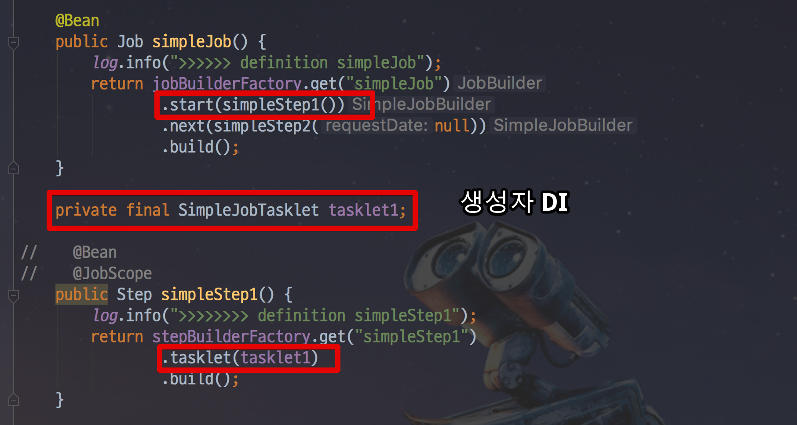

그리고 `SimpleJobTasklet`은 아래와 같이 `@Component`와 `@StepScope`로 **Scope가 Step인 Bean**으로 생성합니다.
이 상태에서 `@Value("#{jobParameters[파라미터명]}`를 Tasklet의 멤버변수로 할당합니다.

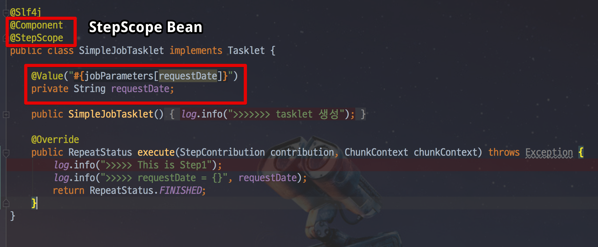

이렇게 **메소드의 파라미터로 JobParameter를 할당받지 않고, 클래스의 멤버 변수로 JobParameter를 할당** 받도록 해도 실행해보시면!

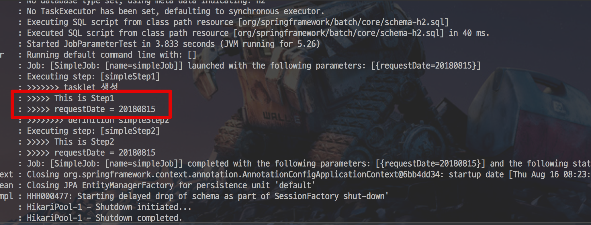

정상적으로 JobParameter를 받아 사용할 수 있습니다.
이는 **SimpleJobTasklet Bean이 `@StepScope`로 생성**되었기 때문입니다.

반면에, 이 SimpleJobTasklet Bean을 일반 singleton Bean으로 생성할 경우 아래와 같이 `'jobParameters' cannot be found` 에러가 발생합니다.

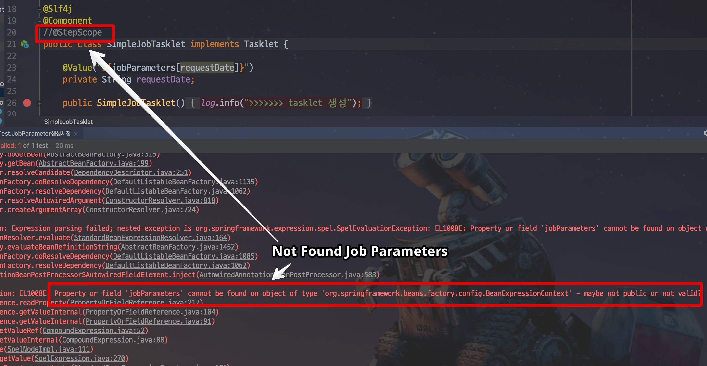

즉, Bean을 메소드나 클래스 어느 것을 통해서 생성해도 무방하나 Bean의 Scope는 Step이나 Job이어야 한다는 것을 알 수 있습니다.

JobParameters를 사용하기 위해선 꼭 **`@StepScope`, `@JobScope`로 Bean을 생성**해야한다는 것을 잊지마세요.

## * JobParameter vs 시스템 변수

앞의 이야기를 보면서 아마 이런 의문이 있을 수 있습니다.

- 왜 꼭 Job Parameter를 써야하지?
- 기존에 Spring Boot에서 사용하던 여러 환경변수 혹은 시스템 변수를 사용하면 되지 않나?
- CommandLineRunner를 사용한다면 `java jar application.jar -D파라미터`로 시스템 변수를 지정하면 되지 않나?

자 그래서 왜 Job Parameter를 써야하는지 설명드리겠습니다.
아래 2가지 코드를 한번 보겠습니다.

**JobParameter**

```java
@Bean
@StepScope
public FlatFileItemReader<Partner> reader(
        @Value("#{jobParameters[pathToFile]}") String pathToFile){
    FlatFileItemReader<Partner> itemReader = new FlatFileItemReader<Partner>();
    itemReader.setLineMapper(lineMapper());
    itemReader.setResource(new ClassPathResource(pathToFile));
    return itemReader;
}
```

**시스템 변수**

> 여기에서 얘기하는 시스템 변수는 application.properties와 `-D` 옵션으로 실행하는 변수까지 포함합니다.

```java
@Bean
@ConfigurationProperties(prefix = "my.prefix")
protected class JobProperties {

    String pathToFile;

    ...getters/setters
}

@Autowired
private JobProperties jobProperties;

@Bean
public FlatFileItemReader<Partner> reader() {
    FlatFileItemReader<Partner> itemReader = new FlatFileItemReader<Partner>();
    itemReader.setLineMapper(lineMapper());
    String pathToFile = jobProperties.getPathToFile();
    itemReader.setResource(new ClassPathResource(pathToFile));
    return itemReader;
}
```

위 2가지 방식에는 몇 가지 차이점이 있습니다.

일단 첫번째로, 시스템 변수를 사용할 경우 **Spring Batch의 Job Parameter 관련 기능을 못쓰게** 됩니다.
예를 들어, Spring Batch는 **같은 JobParameter로 같은 Job을 두 번 실행하지 않습니다**.
하지만 시스템 변수를 사용하게 될 경우 이 기능이 전혀 작동하지 않습니다.
또한 Spring Batch에서 자동으로 관리해주는 Parameter 관련 메타 테이블이 전혀 관리되지 않습니다.

둘째, Command line이 아닌 다른 방법으로 Job을 실행하기가 어렵습니다.
만약 실행해야한다면 **전역 상태 (시스템 변수 혹은 환경 변수)를 동적으로 계속해서 변경시킬 수 있도록** Spring Batch를 구성해야합니다.
동시에 여러 Job을 실행하려는 경우 또는 테스트 코드로 Job을 실행해야할때 문제가 발생할 수 있습니다.

특히 Job Parameter를 못쓰는 점은 큰 단점인데요.
Job Parameter를 못쓴다는 것은 위에서도 언급한 **Late Binding을 못하게 된다**는 의미입니다.

예를 들어 웹 서버가 있고, 이 웹서버에서 Batch를 수행한다고 가정해봅시다.
외부에서 넘겨주는 파라미터에 따라 Batch가 다르게 작동해야한다면, 이를 시스템 변수로 풀어내는 것은 너무나 어렵습니다.
하지만 아래와 같이 Job Parameter를 이용한다면 아주 쉽게 해결할 수 있습니다.

```java
@Slf4j
@RequiredArgsConstructor
@RestController
public class JobLauncherController {

    private final JobLauncher jobLauncher;
    private final Job job;

    @GetMapping("/launchjob")
    public String handle(@RequestParam("fileName") String fileName) throws Exception {

        try {
            JobParameters jobParameters = new JobParametersBuilder()
                                    .addString("input.file.name", fileName)
                                    .addLong("time", System.currentTimeMillis())
                                    .toJobParameters();
            jobLauncher.run(job, jobParameters);
        } catch (Exception e) {
            log.info(e.getMessage());
        }

        return "Done";
    }
}
```

예제를 보시면 Controller에서 Request Parameter로 받은 값을 Job Parameter로 생성합니다.

```java
JobParameters jobParameters = new JobParametersBuilder()
                        .addString("input.file.name", fileName)
                        .addLong("time", System.currentTimeMillis())
                        .toJobParameters();
```

그리고 생성한 Job Parameter로 Job을 수행합니다.

```java
jobLauncher.run(job, jobParameters);
```

즉, 개발자가 원하는 어느 타이밍이든 Job Parameter를 생성하고 Job을 수행할 수 있음을 알 수 있습니다.
Job Parameter를 각각의 Batch 컴포넌트들이 사용하면 되니 **변경이 심한 경우에도 쉽게 대응**할 수 있습니다.

## *spring batch 5 적용

https://alwayspr.tistory.com/49


Spring Boot 3(=Spring Framework 6)부터 `Spring Batch 5` 버전을 사용하게 업데이트 되었다.
Batch 5에 변경점이 많이 생겨 기존의 4버전과 다른 부분이 많이 생겼다.

1. @EnableBatchProcessing

2. JobBuilderFactory, StepBuilderFactory deprecated

3. JobRepository, TransactionManager 명시적으로 변경


### 주요 변경 사항

### JDK 17 기준선

Spring Batch 5는 최소 버전으로 Java 17이 필요한 Spring Framework 6을 기반으로 합니다. 따라서 Spring Batch 5 애플리케이션을 실행하려면 Java 17+를 사용해야 합니다.

### 종속성 업그레이드

Spring Batch 5는 전반적으로 Spring 종속성을 다음 버전으로 업데이트합니다.

- 스프링 프레임워크 6
- 스프링 데이터 3
- Apache Kafka 3용 스프링
- 마이크로미터 1.10

또한 이 버전은 다음으로의 마이그레이션을 표시합니다.

- Jakarta EE 9: 사용하는 모든 EE API에 대해 가져오기 명령문을 에서 `javax.*`로 업데이트하세요 .`jakarta.*`
- Hibernate 6: Hibernate(커서/페이징) 항목 판독기와 기록기가 Hibernate 6.1 API를 사용하도록 업데이트되었습니다(이전에는 Hibernate 5.6 API 사용).

그 외에도:

- `org.springframework:spring-jdbc`이제 필수 종속 항목입니다.`spring-batch-core`
- `junit:junit`는 더 이상 필수 종속성이 아닙니다 `spring-batch-test`.
- `com.fasterxml.jackson.core:jackson-core`이제 선택 사항입니다`spring-batch-core`


### 데이터베이스 스키마 업데이트

#### 신탁

이 버전에서는 이제 Oracle 시퀀스가 주문됩니다. 새로운 애플리케이션을 위해 시퀀스 생성 스크립트가 업데이트되었습니다. 기존 애플리케이션은 의 마이그레이션 스크립트를 사용하여 `org/springframework/batch/core/migration/5.0/migration-oracle.sql`기존 시퀀스를 변경할 수 있습니다.

또한 Oracle용 DDL 스크립트의 이름이 다음과 같이 변경되었습니다.

- `org/springframework/batch/core/schema-drop-oracle10g.sql`이름이 다음으로 변경되었습니다.`org/springframework/batch/core/schema-drop-oracle.sql`
- `org/springframework/batch/core/schema-oracle10g.sql`이름이 다음으로 변경되었습니다.`org/springframework/batch/core/schema-oracle.sql`

#### MS SQL서버

v4까지 MS SQLServer용 DDL 스크립트는 테이블을 사용하여 시퀀스를 에뮬레이트했습니다. 이 버전에서는 이 사용법이 실제 시퀀스로 업데이트되었습니다.

```
CREATE SEQUENCE BATCH_STEP_EXECUTION_SEQ START WITH 0 MINVALUE 0 MAXVALUE 9223372036854775807 NO CACHE NO CYCLE;
CREATE SEQUENCE BATCH_JOB_EXECUTION_SEQ START WITH 0 MINVALUE 0 MAXVALUE 9223372036854775807 NO CACHE NO CYCLE;
CREATE SEQUENCE BATCH_JOB_SEQ START WITH 0 MINVALUE 0 MAXVALUE 9223372036854775807 NO CACHE NO CYCLE;
```


새로운 애플리케이션은 수정 없이 제공된 스크립트를 사용할 수 있습니다. 기존 애플리케이션은 v4에서 사용되는 시퀀스 테이블의 마지막 값에서 시퀀스를 시작하도록 위의 코드 조각을 수정하는 것을 고려해야 합니다.

#### 모든 플랫폼

##### `BATCH_JOB_EXECUTION#JOB_CONFIGURATION_LOCATION`컬럼 제거

`JOB_CONFIGURATION_LOCATION`테이블 의 열은 `BATCH_JOB_EXECUTION`더 이상 사용되지 않으며 필요한 경우 사용되지 않은 것으로 표시하거나 삭제할 수 있습니다.

```
ALTER TABLE BATCH_JOB_EXECUTION DROP COLUMN JOB_CONFIGURATION_LOCATION;
```


컬럼 삭제 구문은 데이터베이스 서버 버전에 따라 다를 수 있으므로 컬럼 삭제 구문을 확인하시기 바랍니다. 일부 플랫폼에서는 이 변경으로 인해 테이블 재구성이 필요할 수 있습니다.

❗ 중요 사항 ❗ 이 변경 사항은 주로 이 칼럼을 사용하는 프레임워크의 유일한 부분인 JSR-352 구현 제거와 관련이 있습니다. 결과적으로 해당 필드 `JobExecution#jobConfigurationName`와 이를 사용하는 모든 API(도메인 객체의 생성자 및 getter , 의 `JobExecution`메서드 )가 제거되었습니다.`JobRepository#createJobExecution(JobInstance, JobParameters, String);``JobRepository`

##### 열 변경`BATCH_JOB_EXECUTION_PARAMS`

가 `BATCH_JOB_EXECUTION_PARAMS`다음과 같이 업데이트되었습니다:

```
CREATE TABLE BATCH_JOB_EXECUTION_PARAMS  (
	JOB_EXECUTION_ID BIGINT NOT NULL ,
---	TYPE_CD VARCHAR(6) NOT NULL ,
---	KEY_NAME VARCHAR(100) NOT NULL ,
---	STRING_VAL VARCHAR(250) ,
---	DATE_VAL DATETIME(6) DEFAULT NULL ,
---	LONG_VAL BIGINT ,
---	DOUBLE_VAL DOUBLE PRECISION ,
+++	PARAMETER_NAME VARCHAR(100) NOT NULL ,
+++	PARAMETER_TYPE VARCHAR(100) NOT NULL ,
+++	PARAMETER_VALUE VARCHAR(2500) ,
	IDENTIFYING CHAR(1) NOT NULL ,
	constraint JOB_EXEC_PARAMS_FK foreign key (JOB_EXECUTION_ID)
	references BATCH_JOB_EXECUTION(JOB_EXECUTION_ID)
);
```


[이는 https://github.com/spring-projects/spring-batch/issues/3960](https://github.com/spring-projects/spring-batch/issues/3960) 에서 다시 설명한 대로 작업 매개변수가 유지되는 방식과 관련이 있습니다 . 마이그레이션 스크립트는 에서 찾을 수 있습니다 `org/springframework/batch/core/migration/5.0`.

##### 열 변경`BATCH_STEP_EXECUTION`

v5에는 새로운 열이 `CREATE_TIME`추가되었습니다. 데이터베이스 서버에 따라 테이블에 다음과 같이 생성해야 합니다.

```
ALTER TABLE BATCH_STEP_EXECUTION ADD CREATE_TIME TIMESTAMP NOT NULL DEFAULT '1970-01-01 00:00:00';
```


또한 `NOT NULL`제약 조건이 열에서 삭제되었습니다 `START_TIME`.

```
ALTER TABLE BATCH_STEP_EXECUTION ALTER COLUMN START_TIME DROP NOT NULL;
```


### 인프라 Bean 구성`@EnableBatchProcessing`

#### 작업 저장소/탐색기 구성 업데이트

맵 기반 작업 저장소/탐색기 구현은 v4에서 더 이상 사용되지 않으며 v5에서 완전히 제거되었습니다. 대신 Jdbc 기반 구현을 사용해야 합니다. 사용자 정의 작업 저장소/탐색기 구현을 사용하지 않는 한 주석은 애플리케이션 컨텍스트에서 Bean이 필요한 `@EnableBatchProcessing`Jdbc 기반을 구성합니다 . Bean 은 H2, HSQL 등과 같은 내장형 데이터베이스를 참조하여 메모리 내 작업 저장소와 작동할 수 있습니다.`JobRepository``DataSource``DataSource`

#### 트랜잭션 관리자 빈 노출/구성

버전 4.3까지 `@EnableBatchProcessing`주석은 애플리케이션 컨텍스트에서 트랜잭션 관리자 Bean을 노출했습니다. 이는 많은 경우에 편리했지만 트랜잭션 관리자가 무조건적으로 노출되면 사용자 정의 트랜잭션 관리자를 방해할 수 있습니다. 이번 릴리스에서는 `@EnableBatchProcessing`더 이상 애플리케이션 컨텍스트에 트랜잭션 관리자 Bean을 노출하지 않습니다. [이 변경 사항은 https://github.com/spring-projects/spring-batch/issues/816](https://github.com/spring-projects/spring-batch/issues/816) 문제와 관련이 있습니다 .

[앞서 언급한 문제와 https://github.com/spring-projects/spring-batch/issues/4130](https://github.com/spring-projects/spring-batch/issues/4130) 에서 수정된 트랜잭션 관리자에 관한 XML 및 Java 구성 스타일 간의 불일치 로 인해 이제 태스크릿 단계 정의에서 트랜잭션 관리자를 수동으로 구성해야 합니다. 방법이 `StepBuilderHelper#transactionManager(PlatformTransactionManager)`한 단계 아래인 `AbstractTaskletStepBuilder`.

이와 관련하여 v4에서 v5로의 일반적인 마이그레이션 경로는 다음과 같습니다.

```
// Sample with v4
@Configuration
@EnableBatchProcessing
public class MyStepConfig {

    @Autowired
    private StepBuilderFactory stepBuilderFactory;

    @Bean
    public Step myStep() {
        return this.stepBuilderFactory.get("myStep")
                .tasklet(..) // or .chunk()
                .build();
    }

}
```


```
// Sample with v5
@Configuration
@EnableBatchProcessing
public class MyStepConfig {

    @Bean
    public Tasklet myTasklet() {
       return new MyTasklet();
    }

    @Bean
    public Step myStep(JobRepository jobRepository, Tasklet myTasklet, PlatformTransactionManager transactionManager) {
        return new StepBuilder("myStep", jobRepository)
                .tasklet(myTasklet, transactionManager) // or .chunk(chunkSize, transactionManager)
                .build();
    }

}
```


이는 태스크릿 단계에만 필요하며, 다른 단계 유형에는 설계상 트랜잭션 관리자가 필요하지 않습니다.

또한 트랜잭션 관리자는 `BatchConfigurer#getTransactionManager`. 트랜잭션 관리자는 의 구현 세부 사항이므로 `JobRepository`와 동일한 수준 `JobRepository`(예: 동일한 인터페이스)에서 구성할 수 없어야 합니다. 이번 릴리스에서는 `BatchConfigurer`인터페이스가 제거되었습니다. 필요한 경우 사용자 정의 트랜잭션 관리자는 의 속성으로 선언적으로 제공되거나 `@EnableBatchProcessing`를 재정의하여 프로그래밍 방식으로 제공될 수 있습니다 `DefaultBatchConfiguration#getTransactionManager()`. [이 변경 사항에 대한 자세한 내용은 https://github.com/spring-projects/spring-batch/issues/3942를](https://github.com/spring-projects/spring-batch/issues/3942) 확인하세요 .

#### JobBuilderFactory 및 StepBuilderFactory 빈 노출/구성

`JobBuilderFactory`더 이상 애플리케이션 컨텍스트에서 빈으로 노출되지 않으며 `StepBuilderFactory`이제 생성한 각 빌더를 사용하기 위해 v5.2에서 제거되지 않습니다.

이와 관련하여 v4에서 v5로의 일반적인 마이그레이션 경로는 다음과 같습니다.

```
// Sample with v4
@Configuration
@EnableBatchProcessing
public class MyJobConfig {

    @Autowired
    private JobBuilderFactory jobBuilderFactory;

    @Bean
    public Job myJob(Step step) {
        return this.jobBuilderFactory.get("myJob")
                .start(step)
                .build();
    }

}
```


```
// Sample with v5
@Configuration
@EnableBatchProcessing
public class MyJobConfig {

    @Bean
    public Job myJob(JobRepository jobRepository, Step step) {
        return new JobBuilder("myJob", jobRepository)
                .start(step)
                .build();
    }

}
```


동일한 패턴을 사용하여 더 이상 사용되지 않는 의 사용을 제거할 수 있습니다 `StepBuilderFactory`. [이 변경 사항에 대한 자세한 내용은 https://github.com/spring-projects/spring-batch/issues/4188을](https://github.com/spring-projects/spring-batch/issues/4188) 확인하세요 .

### 데이터 유형 업데이트

- 및 의 메트릭 카운터( `readCount`, `writeCount`등)가 에서 로 변경되었습니다 . 모든 getter 및 setter가 그에 따라 업데이트되었습니다.`org.springframework.batch.core.StepExecution``org.springframework.batch.core.StepContribution``int``long`
- `skipCount`의 매개변수 가 에서 로 `org.springframework.batch.core.step.skip.SkipPolicy#shouldSkip`변경되었습니다 . 이는 이전 요점과 관련이 있습니다.`int``long`
- `startTime`, `endTime`및 `createTime`의 필드 유형이 에서 `lastUpdated`로 `JobExecution`변경 `StepExecution`되었습니다 .`java.util.Date``java.time.LocalDateTime`

### 관측 가능성 업데이트

- 마이크로미터가 1.10 버전으로 업데이트되었습니다.
- 이제 모든 태그 앞에 미터 이름이 붙습니다. 예를 들어, 타이머의 태그 `spring.batch.job`이름 은 버전 4.x입니다 `name`. `status`버전 5에서는 해당 태그의 이름이 각각 `spring.batch.job.name`및 로 지정됩니다 `spring.batch.job.status`.
- 클래스 `BatchMetrics`(내부 전용)가 패키지 `org.springframework.batch.core.metrics`로 이동되었습니다 `org.springframework.batch.core.observability`.

### 실행 컨텍스트 직렬화 업데이트

v5부터 기본값이 에서 으로 `ExecutionContextSerializer`변경되었습니다 . Base64에서 컨텍스트를 직렬화/역직렬화하도록 기본 실행 컨텍스트 직렬 변환기가 업데이트되었습니다.`JacksonExecutionContextStringSerializer``DefaultExecutionContextSerializer`

Jackson에 대한 의존성은 선택 사항이 되었습니다. `JacksonExecutionContextStringSerializer`를 사용하려면 `jackson-core`클래스패스에 를 추가해야 합니다.

### SystemCommandTasklet 업데이트

이번 릴리스에서는 가 `SystemCommandTasklet`다시 검토되어 다음과 같이 변경되었습니다.

- `CommandRunner`태스크릿 실행에서 명령 실행을 분리하기 위해 명명된 새로운 전략 인터페이스가 도입되었습니다. 기본 구현은 API를 `JvmCommandRunner`사용하여 `java.lang.Runtime#exec`시스템 명령을 실행하는 것입니다. 이 인터페이스는 다른 API를 사용하여 시스템 명령을 실행하도록 구현될 수 있습니다.
- 이제 명령을 실행하는 메서드는 `String`명령과 해당 인수를 나타내는 배열을 허용합니다. 더 이상 명령을 토큰화하거나 사전 처리를 수행할 필요가 없습니다. 이러한 변경으로 인해 API가 더욱 직관적이고 오류 발생 가능성이 낮아졌습니다.

### 업데이트를 처리하는 작업 매개변수

#### 작업 매개변수로 모든 유형 지원

이번 변경으로 v4에서와 같이 미리 정의된 4가지 유형(long, double, string, date)뿐만 아니라 모든 유형을 작업 매개변수로 사용할 수 있는 지원이 추가되었습니다. 주요 변경 사항은 다음과 같습니다.

```
---public class JobParameter implements Serializable {
+++public class JobParameter<T> implements Serializable {

---   private Object parameter;
+++   private T value;

---   private ParameterType parameterType;
+++   private Class<T> type;

}
```


이번 개정판에서는 `JobParameter`모든 유형이 가능합니다. 이 변경으로 인해 의 반환 유형 변경 `getType()`, 열거형 제거 등 많은 API 변경이 필요했습니다 `ParameterType`. 이 업데이트와 관련된 모든 변경 사항은 "[사용되지 않음|이동|제거됨] API" 섹션에서 확인할 수 있습니다.

이 변경 사항은 작업 매개변수가 데이터베이스에서 유지되는 방식에 영향을 미쳤습니다(미리 정의된 각 유형에 대해 더 이상 4개의 고유 열이 없습니다). [DDL 변경 사항 은 BATCH_JOB_EXECUTION_PARAMS의 열 변경 사항을](https://github.com/spring-projects/spring-batch/wiki/Spring-Batch-5.0-Migration-Guide#column-change-in-batch_job_execution_params) 확인하세요 . 이제 매개변수 유형의 정규화된 이름이 `String`매개변수 값뿐만 아니라 로 유지됩니다. 문자열 리터럴은 표준 Spring 변환 서비스를 사용하여 매개변수 유형으로 변환됩니다. 표준 변환 서비스는 사용자 특정 유형을 문자열 리터럴로 변환하는 데 필요한 변환기로 강화될 수 있습니다.

#### 기본 작업 매개변수 변환

v4의 작업 매개변수 기본 표기법은 다음과 같이 지정되었습니다.

```
[+|-]parameterName(parameterType)=value
```


여기서는 `parameterType`[string,long,double,date] 중 하나입니다. 제한적이고 제한적인 것 외에도 이 표기법은 https://github.com/spring-projects/spring-batch/issues/3960 에 설명된 대로 여러 가지 문제를 야기했습니다 .

v5에는 작업 매개변수를 지정하는 두 가지 방법이 있습니다.

##### 기본 표기법

기본 표기법은 다음과 같이 지정됩니다.

```
parameterName=parameterValue,parameterType,identificationFlag
```


`parameterType`매개변수 유형의 완전한 이름은 어디에 있습니까? Spring Batch는 `DefaultJobParametersConverter`이 표기법을 지원하는 를 제공합니다.

##### 확장 표기법

기본 표기법은 대부분의 사용 사례에 적합하지만 예를 들어 값에 쉼표가 포함되어 있으면 불편할 수 있습니다. 이 경우 Spring Boot의 [Json 애플리케이션 속성](https://docs.spring.io/spring-boot/docs/current/reference/html/features.html#features.external-config.application-json) 에서 영감을 받아 다음과 같이 지정된 확장 표기법을 사용할 수 있습니다.

```
parameterName='{"value": "parameterValue", "type":"parameterType", "identifying": "booleanValue"}'
```


`parameterType`매개변수 유형의 완전한 이름은 어디에 있습니까? Spring Batch는 `JsonJobParametersConverter`이 표기법을 지원하는 를 제공합니다.

##### 기록 데이터 액세스 영향

작업 매개변수 처리에 대한 이러한 주요 변경으로 인해 배치 메타데이터를 탐색하도록 설계된 일부 API는 v4에서 시작된 작업 인스턴스에 사용되어서는 **안 됩니다.** 예를 들어:

- `JobExplorer#getJobInstances`v4와 v5 사이의 혼합 기록 데이터를 검색할 수 있으며 v4의 작업 매개변수를 로드할 때 실패할 수 있습니다( [#4352](https://github.com/spring-projects/spring-batch/issues/4352) ). 이 특별한 경우에는 v5로 실행된 첫 번째 인스턴스의 인덱스에서 시작해야 합니다.
- `JobExplorer#getJobExecution`전달된 작업 실행 ID가 v4로 실행된 실행 중 하나인 경우 작업 매개변수 검색에 실패할 수 있습니다.

이 변경이 작업 매개변수 로드에 영향을 미치는 또 다른 경우는 실패한 작업 인스턴스를 다시 시작할 때입니다. 실패한 모든 v4 작업 인스턴스는 성공을 위해 다시 시작되거나 v5로의 마이그레이션이 완료되기 *전에* 중단될 것으로 예상됩니다 .


## *프록시란?

프록시의 사전적 정의는 '대리인'으로, 간단하게 설명하면 내가 어떤 객체를 사용하려고 할 때 해당 객체에 직접 요청하는 것이 아닌 중간에 가짜 프록시 객체(대리인)를 두어서 프록시 객체가 대신해서 요청을 받아 실제 객체를 호출해 주도록 하는 것이다.


- 프록시 모드를 설정하게 되면, 의존성 주입을 통해 주입되는 빈은 실제 빈이 아닌 해당 빈을 상속받은 가짜 프록시 객체이다.
- 스프링은 CGLIB이라는 바이트 코드를 조작하는 라이브러리를 사용해서 프록시 객체를 주입해준다.
- 프록시 객체 내부에는 실제 빈을 요청하는 로직이 들어있어, **클라이언트의 요청이 오면 그때 실제 빈을 호출해준다**.(실제 빈의 조회를 필요한 시점까지 지연 처리)
- 프록시 객체는 원래 빈을 상속받아서 만들어지기 때문에 클라이언트 입장에서는 실제 빈을 사용하는 것과 똑같은 방법으로 사용하면 된다.
- @Scope 애노테이션의 proxyMode 옵션을 사용하여 설정할 수 있다.
